# Shortly - URL Shortener

It is an URL shortener built with Django. This functionality is meant for sajidifti.com. It is integrated with my website.
 
Please Visit: <https://sajidifti.com/Shorty>

## Features

- **Shorten** - Shorten a URL
- **Custom URL** - Get a custom short URL
- **Copy** - Copy a shortened URL
- **reCaptcha** - reCaptcha protection
- **Email Login** - Login with email
- **Acount Activation** - Account activation with email activation
- **Notification Email** - Notifications via email
- **Admin** - Admin panel. Admin can approve users.
- **Users** - All User panel. Admin deactivate and delete users.
- **All URLs** - All URLs panel. Admin can see URLs and delete URLs.
- **My URLs** - My URLs panel. Users can see URLs and delete URLs.
- **Profile** - Profile panel. Users can change their password and profile picture. Users can delete their account. Logout button is present in this page.

## How to use

1. Install the requirements
2. Run the following command
`python manage.py runserver`
3. Visit <http://127.0.0.1:8000/> in your browser

## Contact

- Email: <info@sajidifti.com>
- Github: <https://github.com/sajidifti>
- LinkedIn: <https://www.linkedin.com/in/sajidifti>

## License

MIT License

## UI Screenshot

## Admin Home

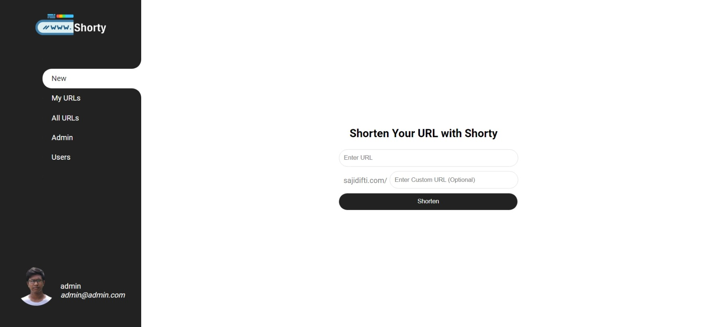

## Users Home

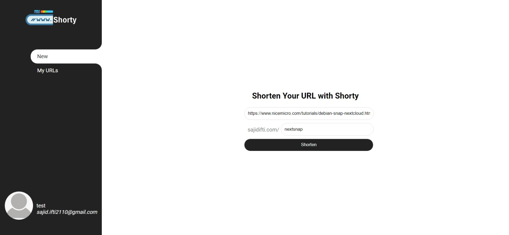

## Shortened URL

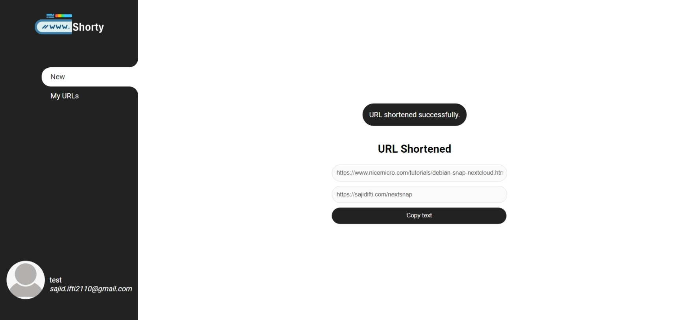

## Profile

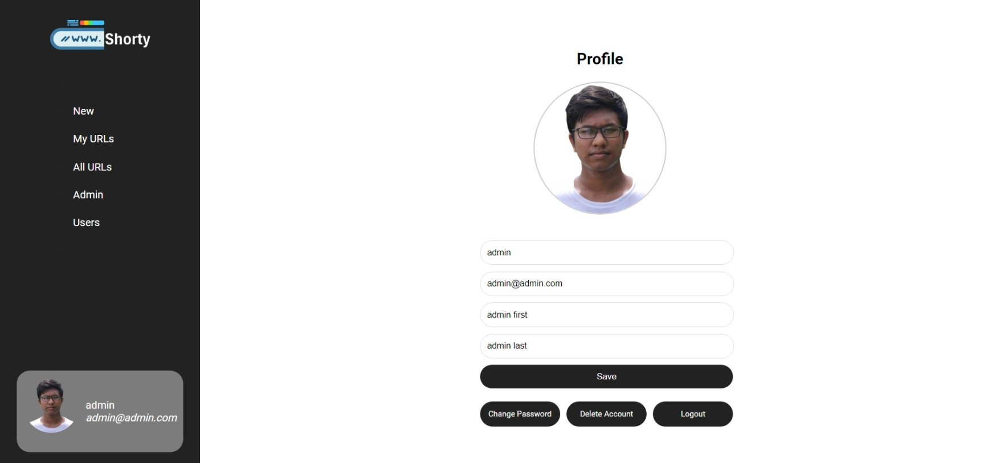

## My URLs

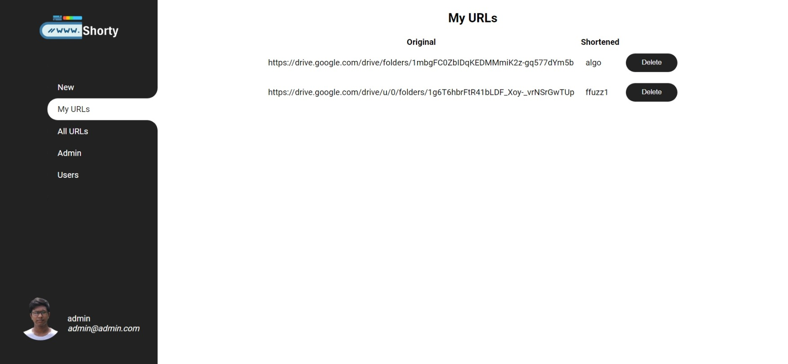

## All URLs

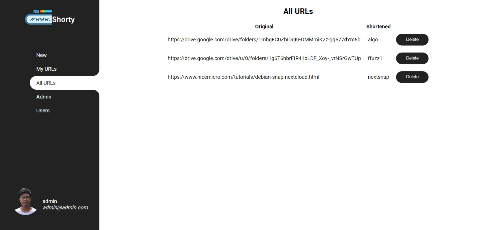

## User Approval Admin Panel

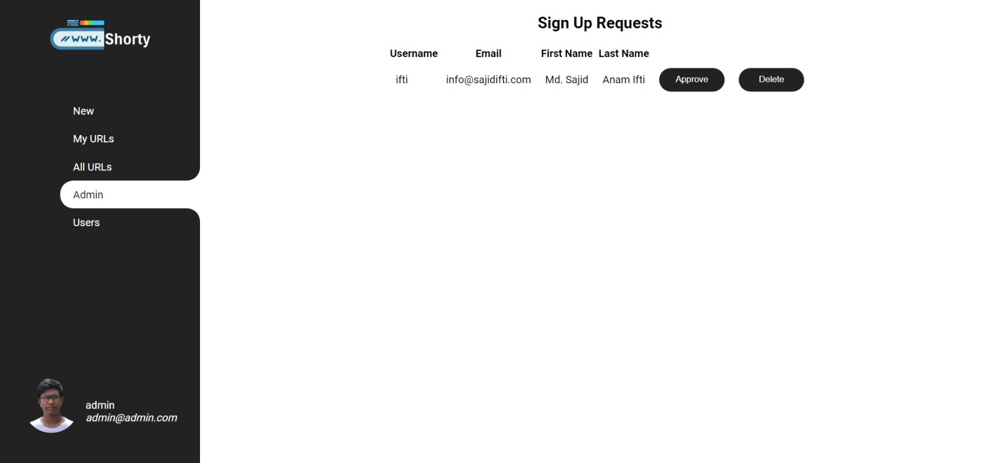

## User Management Admin Panel

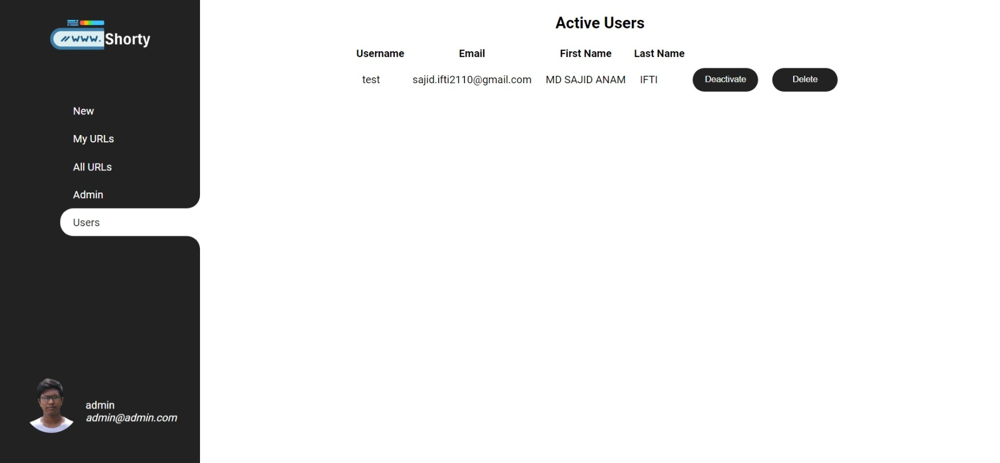

## Login

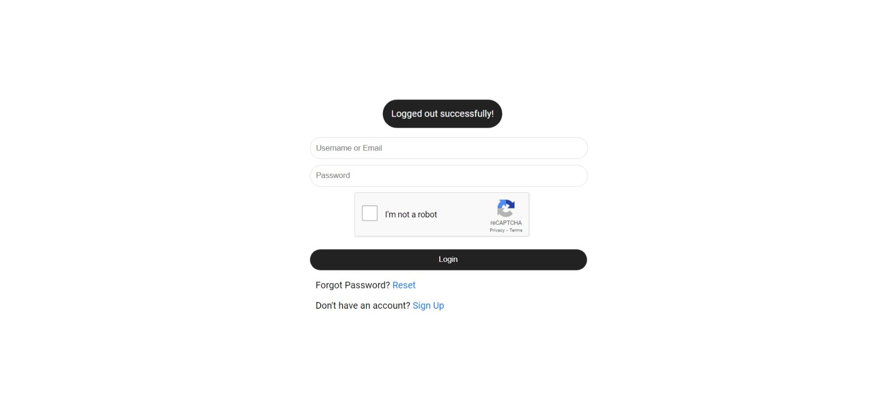

## Signup

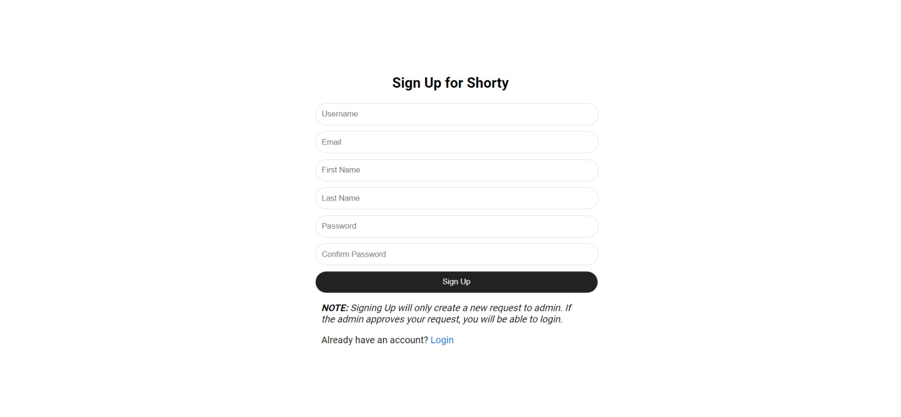

## Change Password

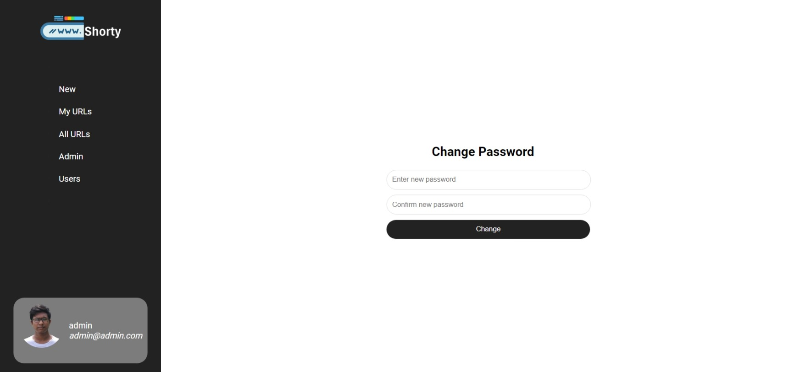

## Reset Password

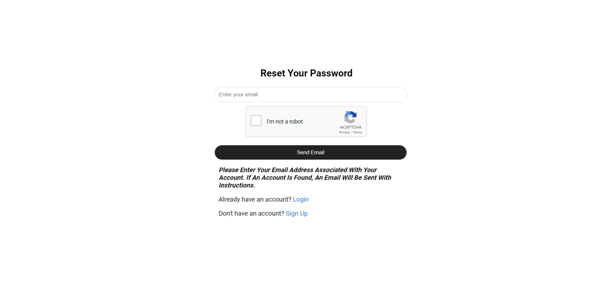
